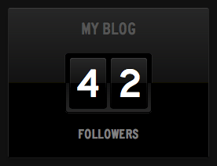

# Tumblr Status Board Panel

This web application can be used to pull in follower counts of your blogs hosted
by [Tumblr](https://tumblr.com) and display them on your
[Status Board](https://panic.com/statusboard).

## Configuration

To configure your own instance of this panel, you should be familiar with
running Sinatra or Ruby on Rails instances. Of course, if you are not familiar
with setting up and running a Sinatra web application, the easiest route is to
use [Heroku](https://heroku.com).

Please reference [this tutorial](https://devcenter.heroku.com/articles/git)
for more information about deploying to Heroku.

### Defining Your Credentials

You will need to provide your Tumblr Consumer Key and Secret, which you can
obtain by creating a new application at https://www.tumblr.com/oauth/apps.

Once you have your key and secret, you should update the `app.rb` file to
include them, like so:

    set :consumer_key, "<your consumer key>"
    set :consumer_secret, "<your consumer secret>"

Alternatively, you may set `TUMBLR_KEY` and `TUMBLR_SECRET` in the application's
environment (i.e. using `heroku config:set`).

## Author

Developed by Justin Mecham ([email](mailto:justin@mecham.me),
[twitter](https://twitter.com/jsmecham)).

## License

This project is licensed under the terms of the MIT License.
